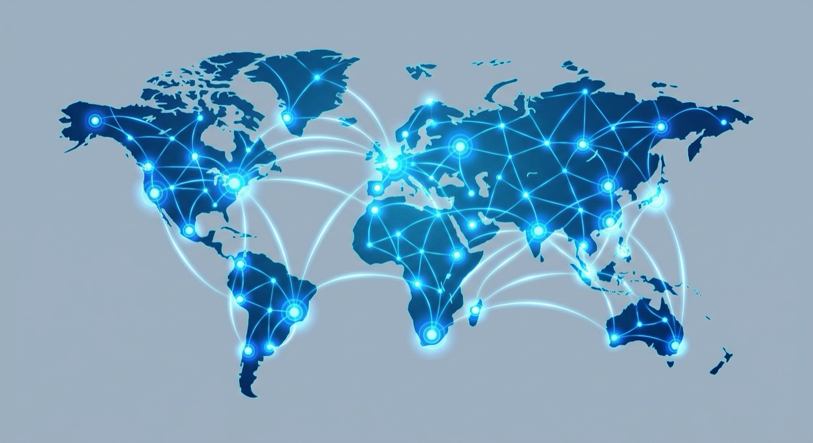

::: {.hero-section}
# Enterprise Cloud Infrastructure for Modern Business

### Trusted by 500+ organizations worldwide with 99.9% uptime guarantee

::: {.trust-metrics}
::: {.metric}
**500+**
Active Clients
:::

::: {.metric}
**99.9%**
Uptime SLA
:::

::: {.metric}
**2**
Data Centers
:::

::: {.metric}
**24/7**
Support
:::
:::

[Schedule a Demo](contact.qmd){.btn .btn-primary .btn-lg role="button"}
[View Solutions](solutions.qmd){.btn .btn-outline-primary .btn-lg role="button"}
:::

::: {.hero-band}

:::

## Why CloudCore Networks?

We combine enterprise-grade infrastructure with innovative cloud solutions to power your digital transformation.

::: {layout-ncol=3 #solutions}

::: {.feature-card #cloud-hosting}
 **Cloud Hosting**  
Enterprise-grade infrastructure with automated scaling, load balancing, and global CDN distribution for optimal performance.
:::

::: {.feature-card #managed-services}
 **Managed Services**  
Full-stack management including 24/7 monitoring, automated backups, security patches, and dedicated support team.
:::

::: {.feature-card #security-compliance}
 **Security & Compliance**  
ISO 27001 certified with end-to-end encryption, DDoS protection, and compliance with GDPR, HIPAA, and SOC 2.
:::

::: {.feature-card}
 **DevOps Integration**  
Seamless CI/CD pipelines, container orchestration with Kubernetes, and infrastructure as code support.
:::

::: {.feature-card}
 **High Availability**  
Multi-region deployment, automatic failover, and 99.9% uptime SLA with transparent status monitoring.
:::

::: {.feature-card}
 **Expert Support**  
Dedicated account managers, 24/7 technical support, and access to cloud architects for optimization.
:::
:::

## What Our Clients Say

::: {.testimonials}

::: {.testimonial-section}
> "CloudCore transformed our infrastructure, reducing costs by 40% while improving performance. Their 24/7 support has been invaluable."

**Sarah Mitchell**  
*CTO, TechVentures Inc.*
:::

::: {.testimonial-section}
> "The migration was seamless. CloudCore's managed services team handled everything — zero unplanned downtime in 18 months."

**David Chen**  
*IT Director, Helena Industries*
:::

::: {.testimonial-section}
> "Their security expertise gave our board real confidence. The ISO 27001 audit was straightforward with CloudCore's documentation."

**Priya Nair**  
*Head of Data, Modus Retail*
:::

:::

## Security & Compliance

Our infrastructure meets the highest international security and compliance standards — protecting your data from the physical data center to the application edge.

::: {layout-ncol=2}

::: {.certifications}
- **ISO 27001:2013** Certified Information Security Management
- **SOC 2 Type II** Audited Security Controls
- **GDPR** Compliant Data Protection
- **HIPAA** Healthcare Information Security
- **PCI DSS** Payment Card Industry Standards
:::

::: {.section-figure}

:::

:::
